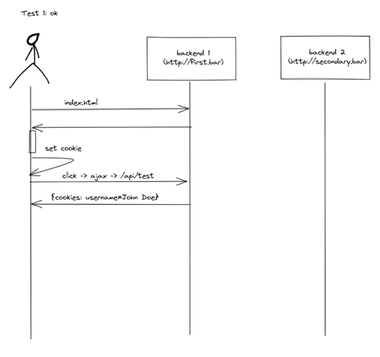
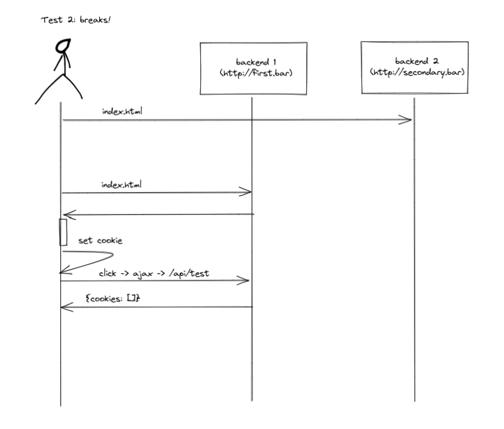

# Cypress does not send cookies in docker when in session or using origin

## What does it do

It starts a two docker containers with the same image for a testing backend that serves an `index.html` and responses with used cookies on an `/api/test` handler. It runs Cypress in the same setup and checks if the cookies are sent.

Test 1 where just the first backend is called works:

Test 2 where the second backend is called first breaks:

This happens only in when running cypress in docker. It is independent of setting the cookie to secure or switch between SameSite lax and strict.

The problem occurs with tested Cypress version 10.2.0, 10.3.0 and 10.6.0.

## Howto

### Docker

Just install `docker` and run `run.sh`

### Local

Just install `yarn` and run `run_local.sh`
